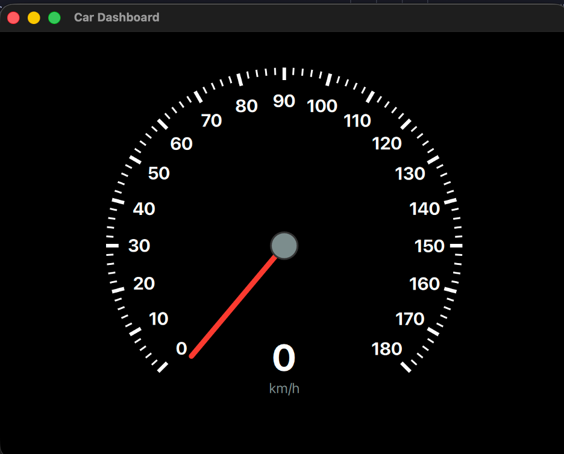
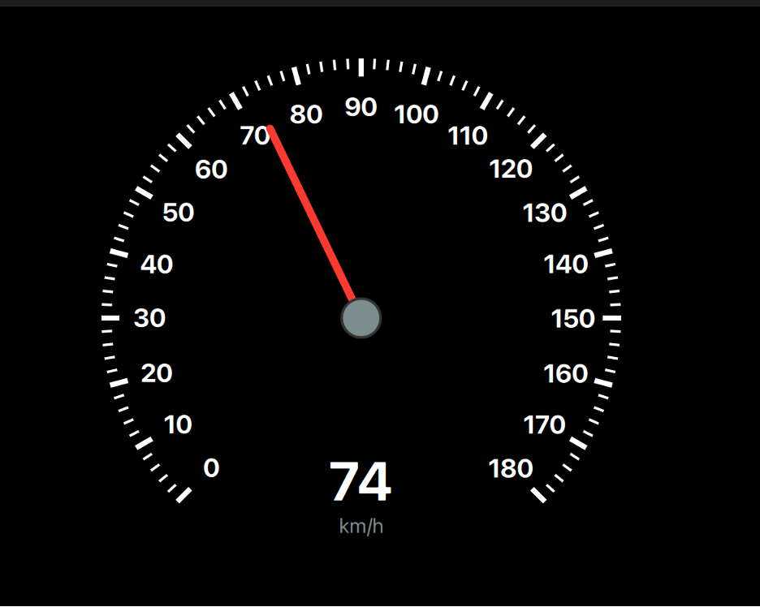
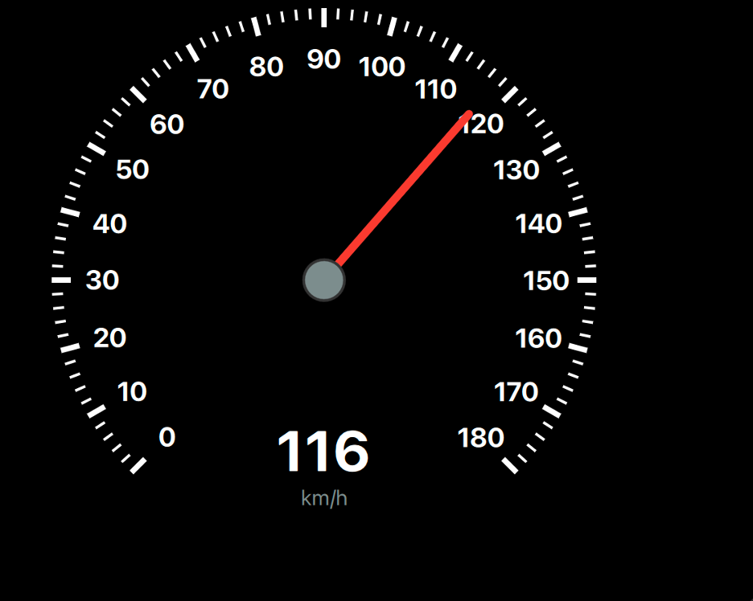
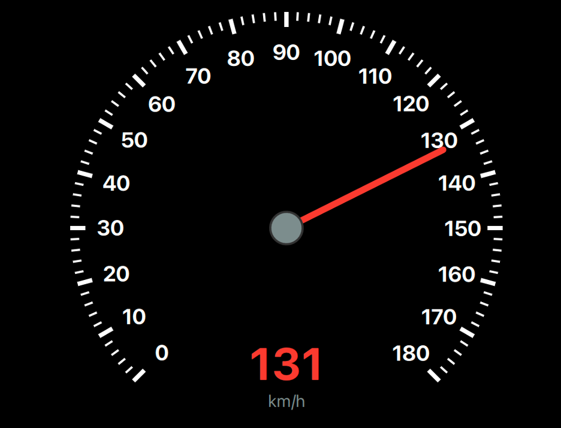

# Car Dashboard Speedometer

A Qt/QML based speedometer dashboard for automotive applications.

## Visual Showcase

Below is a sequence of the speedometer at different speed levels:

## Getting Started

### Prerequisites

- Qt 6.x
- CMake

### Build Instructions

1. Open the project in Qt Creator.
2. Configure the project with your desired kit.
3. Build and Run.
